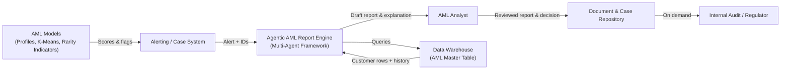

# Value Stream 2 – Agentic AML Behavior Reports

## A. Scope, Demand & Outcome

### Stakeholder
Risk & AML team, internal audit, regulators.

### Trigger (Source of Demand)
Customer flagged as anomalous by AML models.

### Start of Stream
Alert is created for (SNAPSHOT_DATE, CUSTOMER_ID).

### End of Stream
Approved AML behavior report stored in case management, with decision recorded.

### Example Demand & Cadence
- **~200 alerts per month** require full behavior reports
- **Desired SLA**: ≤ 2 business days from alert to signed-off report

---

## B. Information Flow



---

## C. Process Steps with Sample VSM Metrics

### C.1 Current vs Future-State Process Table (per alert)

| # | Step | Main Activities | Primary Actor (Today → With AI) | Key Systems | PT_Current (min) | Wait_Current (min) | PT_Future (min) | Wait_Future (min) | AI / Automation Opportunity |
|---|------|-----------------|--------------------------------|-------------|------------------|-------------------|-----------------|-------------------|------------------------------|
| 1 | Alert Intake & Context Load | Receive alert; pull AML master-table row & history; look up variable definitions | AML analyst → Context-extraction agent + analyst | Alert system, Data warehouse, Variable dictionary | 30 | 60 | 10 | 30 | Agent fetches data, aligns it with dictionary, builds structured case context |
| 2 | Behavioral Analysis | Compare recent vs 6/12-month behavior; analyze amount intensity, volatility, frequency, channel, product; distance from peers | Analyst → Analytical agent + statistics | Data warehouse, K-Means outputs, rarity indicators | 90 | 240 | 30 | 120 | Agent runs all comparisons and produces structured "feature deltas" |
| 3 | Typology Mapping | Map patterns to known AML typologies; assess risk level; list implicated products/channels | Analyst → Typology-mapping agent | AML typology knowledge base, rules | 60 | 120 | 20 | 60 | Agent matches pattern signatures to typologies & drafts rationale |
| 4 | Narrative & Recommendation Draft | Produce structured report (why anomalous, what changed, where, which typologies, recommended actions) | Analyst → Report-generation agent + analyst | Multi-agent framework, Large Language Model, templates | 120 | 240 | 60 | 120 | Agent drafts narrative, tables, recommendations |
| 5 | Human Review, Decision & Archiving | Review report; adjust; choose action; sign-off; store report & decision | AML analyst → Analyst (AI-assisted checklist) | Case management, Document repository | 60 | 120 | 30 | 60 | Agent enforces checklists, flags gaps, ensures all required sections are complete |

**Legend:**
- **PT** = Processing Time (touch time)
- **Wait** = Queue/idle time between steps

---

## D. Timeline & Lead Time

### D.1 Current-State Timeline (per alert)

| Step | PT_Current (min) | Wait_Current (min) | Cumulative Lead Time (min) |
|------|------------------|-------------------|---------------------------|
| 1 – Alert Intake & Context Load | 30 | 60 | 90 |
| 2 – Behavioral Analysis | 90 | 240 | 420 |
| 3 – Typology Mapping | 60 | 120 | 600 |
| 4 – Narrative & Recommendation Draft | 120 | 240 | 960 |
| 5 – Human Review, Decision & Archiving | 60 | 120 | 1,140 |

**Summary:**
- **Total processing time (PT_current)**: 30+90+60+120+60 = **360 min = 6 hours**
- **Total wait time (Wait_current)**: 60+240+120+240+120 = **780 min = 13 hours**
- **Total lead time (Current)**: **1,140 min = 19 hours ≈ 2.4 workdays** (at 8h/day)

### D.2 Future-State Timeline (with AI agents)

| Step | PT_Future (min) | Wait_Future (min) | Cumulative Lead Time (min) |
|------|-----------------|-------------------|---------------------------|
| 1 – Alert Intake & Context Load | 10 | 30 | 40 |
| 2 – Behavioral Analysis | 30 | 120 | 190 |
| 3 – Typology Mapping | 20 | 60 | 270 |
| 4 – Narrative & Recommendation Draft | 60 | 120 | 450 |
| 5 – Human Review, Decision & Archiving | 30 | 60 | 540 |

**Summary:**
- **Total processing time (PT_future)**: 10+30+20+60+30 = **150 min ≈ 2.5 hours**
- **Total wait time (Wait_future)**: 30+120+60+120+60 = **390 min = 6.5 hours**
- **Total lead time (Future)**: **540 min ≈ 9 hours ≈ 1.1 workdays**

### D.3 Lead Time & Productivity Gain (Per Alert)

#### Lead Time Reduction
- **From**: 19 hours → 9 hours
- **Absolute reduction**: 10 hours
- **Percentage improvement**: ~53% shorter end-to-end lead time

#### Manual Processing Time Reduction
- **From**: 6 hours → 2.5 hours
- **Savings**: 3.5 hours of analyst time per alert
- **Percentage improvement**: ~58% less manual effort

---

## E. Sample ROI – AML Reporting Stream

### E.1 Assumptions
- **Alerts requiring full reports per month**: 200
- **AML analyst fully loaded cost**: $70/hour (higher due to specialization & compliance overhead)
- **Time saved per alert**: 3.5 hours manual effort

### E.2 Time & Cost Savings

**Monthly hours saved:**
```
3.5 hours/alert × 200 alerts/month = 700 hours/month
```

**Monthly cost savings:**
```
700 hours × $70/hour = $49,000/month
```

**Annual cost savings:**
```
$49,000/month × 12 = $588,000/year
```

### E.3 Simple Investment View

**Suppose:**
- One-off implementation cost (agentic framework, typology library integration, report templates, testing): $150,000
- Additional annual run/maintenance cost: $100,000

**Then:**

**Total "Year 1" cost:**
```
$150,000 + $100,000 = $250,000
```

**Year 1 net effect:**
```
$588,000 savings – $250,000 cost = $338,000 net benefit
```

**Simple ROI (Year 1):**
```
$338,000 / $250,000 ≈ 135%
```

**Payback time:**
```
$250,000 / $49,000 ≈ 5.1 months
```

### E.4 ROI Summary

| Period | Investment | Savings | Net Benefit | Cumulative ROI |
|--------|-----------|---------|-------------|----------------|
| Year 1 | $250,000 | $588,000 | $338,000 | 135% |
| Year 2 | $100,000 | $588,000 | $488,000 | 330% |
| Year 3 | $100,000 | $588,000 | $488,000 | 546% |

**Note:** This is the stream that really pays for the platform and provides a strong narrative for compliance and regulators.

---

## F. Compliance & Regulatory Benefits

Beyond direct cost savings, the agentic AML solution delivers significant compliance and audit benefits:

### F.1 Audit Trail & Explainability
- Complete digital trail of every analysis step
- Traceable reasoning from data → analysis → typology → recommendation
- Timestamps and version control for all report components

### F.2 Consistency & Standardization
- Uniform application of typology matching rules
- Consistent report structure across all analysts
- Reduced variance in risk assessments

### F.3 Regulatory Readiness
- On-demand report regeneration with updated parameters
- Rapid response to regulatory inquiries
- Demonstrable due diligence through systematic approach

### F.4 Quality Improvement
- AI-assisted checklists catch missing sections
- Cross-validation of behavioral metrics
- Automated flagging of incomplete analyses

---

## G. Next Steps

1. **Use Case Documentation**: Complete the [Use Case Card Template](../../support-materials/templates/template-use-case-card.md)
2. **Detailed ROI Analysis**: Use the [ROI Estimation Template](../../support-materials/templates/template-roi-estimation.md)
3. **Opportunity Assessment**: Apply the [Opportunity Checklist](../../support-materials/templates/template-opportunity-checklist.md)
4. **Implementation Planning**: Review [VSM Guide](../../support-materials/guides/vsm-guide.md) for implementation best practices

---

**Document Version**: 1.0  
**Last Updated**: November 2025  
**Owner**: AML & Compliance Analytics Team
