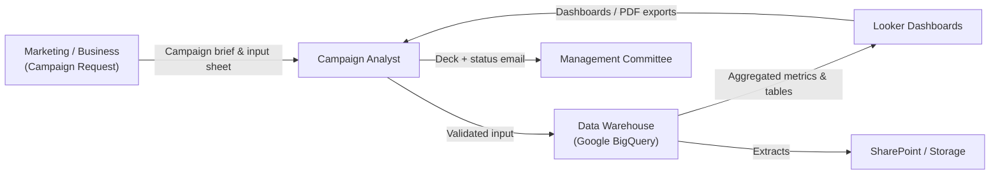

# Value Stream 1 – Campaign Execution & Committee Presentation

## A. Scope, Demand & Outcome

### Stakeholder
Marketing & Management Committee

### Trigger (Source of Demand)
New or updated campaign that must be executed and reported.

### Start of Stream
Campaign brief + raw input data received.

### End of Stream
Committee receives a standardized PowerPoint deck + confirmation email, based on validated data and dashboards.

### Example Demand & Cadence
- **~20 campaigns per month** require committee reporting
- **Desired SLA**: ≤ 5 business days from request to deck (current), target ≤ 2 business days (future)

---

## B. Information Flow



---

## C. Process Steps with Sample VSM Metrics

### C.1 Current vs Future-State Process Table (per campaign)

| # | Step | Main Activities | Primary Actor (Today → With AI) | Key Systems | PT_Current (min) | Wait_Current (min) | PT_Future (min) | Wait_Future (min) | AI / Automation Opportunity |
|---|------|-----------------|--------------------------------|-------------|------------------|-------------------|-----------------|-------------------|------------------------------|
| 1 | Input Capture & Validation | Receive brief; check mandatory fields; validate IDs vs reference data; clarify issues | Human analyst → Analyst + data-quality agent | Email, Google Sheets, BigQuery | 120 | 360 | 30 | 120 | Agent cross-checks fields, validates vs reference tables, drafts clarification emails |
| 2 | Data Preparation & Evaluation | Load data; compute aggregates; apply evaluation rules; flag anomalies | Data engineer/analyst → Orchestrated pipeline + monitoring agent | BigQuery, Cloud Storage | 180 | 480 | 60 | 180 | Agents orchestrate SQL/ETL, monitor runs, summarize evaluation results |
| 3 | Monitoring & Tracking Setup | Setup/update monitoring views; ensure rolling updates; publish extracts | Analyst → Monitoring agent + human oversight | BigQuery, Cloud Storage, SharePoint | 90 | 240 | 45 | 120 | Agent maintains views/tables and posts tracking files automatically |
| 4 | Analytical Review | Check Looker dashboards; validate KPIs; investigate anomalies | Analyst → Analyst + insight-summarization agent | Looker, BigQuery | 120 | 240 | 60 | 120 | Agent generates first-pass insight summary & anomaly explanations |
| 5 | Availability Confirmation | Draft & send email confirming readiness; share links | Analyst → Communication agent + final human send | Email, Looker links, SharePoint | 30 | 120 | 15 | 60 | Agent composes status email, pulls links, proposes wording |
| 6 | PPT Assembly | Export charts, build slides, standardize layout, save deck | Analyst → Slide-generation agent + human editor | Looker, PowerPoint, templates | 180 | 240 | 60 | 120 | Agent auto-builds deck from templates & selected metrics |

**Legend:**
- **PT** = Processing Time (touch time)
- **Wait** = Queue/idle time between steps

---

## D. Timeline & Lead Time

### D.1 Current-State Timeline (per campaign)

| Step | PT_Current (min) | Wait_Current (min) | Cumulative Lead Time (min) |
|------|------------------|-------------------|---------------------------|
| 1 – Input Capture & Validation | 120 | 360 | 480 |
| 2 – Data Preparation & Evaluation | 180 | 480 | 1,140 |
| 3 – Monitoring & Tracking Setup | 90 | 240 | 1,470 |
| 4 – Analytical Review | 120 | 240 | 1,830 |
| 5 – Availability Confirmation | 30 | 120 | 1,980 |
| 6 – PPT Assembly | 180 | 240 | 2,400 |

**Summary:**
- **Total processing time (PT_current)**: 120+180+90+120+30+180 = **720 min = 12 hours**
- **Total wait time (Wait_current)**: 360+480+240+240+120+240 = **1,680 min = 28 hours**
- **Total lead time (Current)**: **2,400 min = 40 hours ≈ 5 workdays** (at 8h/day)

### D.2 Future-State Timeline (with AI agents)

| Step | PT_Future (min) | Wait_Future (min) | Cumulative Lead Time (min) |
|------|-----------------|-------------------|---------------------------|
| 1 – Input Capture & Validation | 30 | 120 | 150 |
| 2 – Data Preparation & Evaluation | 60 | 180 | 390 |
| 3 – Monitoring & Tracking Setup | 45 | 120 | 555 |
| 4 – Analytical Review | 60 | 120 | 735 |
| 5 – Availability Confirmation | 15 | 60 | 810 |
| 6 – PPT Assembly | 60 | 120 | 990 |

**Summary:**
- **Total processing time (PT_future)**: 30+60+45+60+15+60 = **270 min ≈ 4.5 hours**
- **Total wait time (Wait_future)**: 120+180+120+120+60+120 = **720 min = 12 hours**
- **Total lead time (Future)**: **990 min ≈ 16.5 hours ≈ 2.1 workdays**

### D.3 Lead Time & Productivity Gain (Per Campaign)

#### Lead Time Reduction
- **From**: 40 hours → 16.5 hours
- **Absolute reduction**: 23.5 hours
- **Percentage improvement**: ~59% shorter end-to-end lead time

#### Manual Processing Time Reduction
- **From**: 12 hours → 4.5 hours
- **Savings**: 7.5 hours of analyst time per campaign
- **Percentage improvement**: ~62.5% less manual effort

---

## E. Sample ROI – Campaign Reporting Stream

### E.1 Assumptions
- **Campaigns per month**: 20
- **Analyst fully loaded cost**: $60/hour (salary + benefits + overhead)
- **Time saved per campaign**: 7.5 hours manual effort

### E.2 Time & Cost Savings

**Monthly hours saved:**
```
7.5 hours/campaign × 20 campaigns/month = 150 hours/month
```

**Monthly cost savings:**
```
150 hours × $60/hour = $9,000/month
```

**Annual cost savings:**
```
$9,000/month × 12 = $108,000/year
```

### E.3 Simple Investment View

**Suppose:**
- One-off implementation cost (agents, pipelines, templates): $80,000
- Additional annual run/maintenance cost: $40,000

**Then:**

**Total "Year 1" cost:**
```
$80,000 + $40,000 = $120,000
```

**Year 1 net effect:**
```
$108,000 savings – $120,000 cost ≈ -$12,000 (almost breakeven)
```

**From Year 2 onward:**
```
Only $40,000 run cost vs $108,000 savings → ≈ $68,000 net savings/year
```

### E.4 ROI Summary

| Period | Investment | Savings | Net Benefit | Cumulative ROI |
|--------|-----------|---------|-------------|----------------|
| Year 1 | $120,000 | $108,000 | -$12,000 | -10% |
| Year 2 | $40,000 | $108,000 | $68,000 | +23% |
| Year 3 | $40,000 | $108,000 | $68,000 | +62% |

**Note:** With some tuning (more campaigns included, or slightly higher hourly cost), this stream alone becomes clearly positive NPV; combined with AML it's a no-brainer.

---

## F. Next Steps

1. **Use Case Documentation**: Complete the [Use Case Card Template](../../support-materials/templates/template-use-case-card.md)
2. **Detailed ROI Analysis**: Use the [ROI Estimation Template](../../support-materials/templates/template-roi-estimation.md)
3. **Opportunity Assessment**: Apply the [Opportunity Checklist](../../support-materials/templates/template-opportunity-checklist.md)
4. **Implementation Planning**: Review [VSM Guide](../../support-materials/guides/vsm-guide.md) for implementation best practices

---

**Document Version**: 1.0  
**Last Updated**: November 2025  
**Owner**: Campaign Analytics Team
