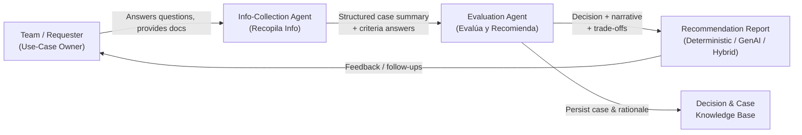

# Value Stream 3 – GenAI Use-Case Evaluation & Recommendation Engine

## A. Scope, Demand & Outcome

### Stakeholder
Architecture, AI Governance, and Product teams.

### Trigger (Source of Demand)
A team submits a new use case and asks:
> "Should we use Generative AI here, or is deterministic logic enough?"

### Start of Stream
Initial description of the use case is provided.

### End of Stream
A documented recommendation (Deterministic / GenAI / Hybrid) with trade-offs, stored in a knowledge base.

### Example Demand & Cadence
- **~40 use-case evaluations per month**
- **Current target**: Decision within 2 working days
- **Future goal**: Same-day answer for most cases

---

## B. Information Flow



### Key Information Objects

1. **Initial use-case description** (text, slides, emails, etc.)
2. **Answers to decision-tree questions**
3. **Structured case summary** (context, constraints, data types, outputs)
4. **Final recommendation report** (decision + rationale + trade-offs)
5. **Stored case record** (for reuse, benchmarks, governance)

---

## C. Process Steps with Sample VSM Metrics

### C.1 Current vs Future-State Process Table (per use case)

| # | Step | Main Activities | Primary Actor (Today → With AI) | Key Systems / Tools | PT_Current (min) | Wait_Current (min) | PT_Future (min) | Wait_Future (min) | AI / Automation Opportunity |
|---|------|-----------------|--------------------------------|---------------------|------------------|-------------------|-----------------|-------------------|------------------------------|
| 1 | Collect Evaluation Data | Identify required data to apply decision tree; ask if problem can be solved with clear deterministic rules; ask if desired output is natural language; ask if unstructured data must be analyzed; request summary of use case | AI architect / analyst via email or meetings → Info-collection agent + brief human review | Chat / email, forms, documentation; "Get Criteria" tool | 45 | 240 | 15 | 60 | Agent interviews requester using scripted questions, validates completeness, and produces structured summary |
| 2 | Apply Decision Tree & Draft Preliminary Verdict | Compare answers against criteria: (a) clear deterministic rules → procedural; (b) natural language output → GenAI; (c) unstructured data → GenAI; apply conditional logic and conclude if GenAI, deterministic, or hybrid is appropriate; generate preliminary explanation | AI architect manually → Evaluation agent with rule engine + human oversight | Decision-tree rules, "Get Criteria" tool, internal guidelines, rules engine | 60 | 240 | 15 | 60 | Agent executes decision tree, logs reasoning steps, drafts initial verdict automatically |
| 3 | Generate Recommendation, Trade-offs & Documentation | Add warnings (non-determinism, audit/auditability, compliance); highlight benefits of GenAI; outline risks/limitations of both choices; provide comparative examples from case library; propose hybrids if relevant; assemble final recommendation report | AI architect + governance lead → Evaluation agent drafts report, human refines | Multi-agent framework, LLM, case library, "Generate Report" tool, DB to save decisions | 60 | 180 | 30 | 60 | Agent generates full narrative report and suggested decision; saves case + rationale to DB; human only edits and signs off |

**Legend:**
- **PT** = Processing Time (touch time)
- **Wait** = Queue/idle time between steps

---

## D. Timeline & Lead Time

### D.1 Current-State Timeline (per use case)

| Step | PT_Current (min) | Wait_Current (min) | Cumulative Lead Time (min) |
|------|------------------|-------------------|---------------------------|
| 1 – Collect Evaluation Data | 45 | 240 | 285 |
| 2 – Apply Decision Tree & Draft Preliminary Verdict | 60 | 240 | 585 |
| 3 – Recommendation, Trade-offs & Documentation | 60 | 180 | 825 |

**Summary:**
- **Total processing time (PT_current)**: 45+60+60 = **165 min ≈ 2.75 hours**
- **Total wait time (Wait_current)**: 240+240+180 = **660 min ≈ 11 hours**
- **Total lead time (Current)**: **825 min = 13.75 hours ≈ 1.7 workdays**

### D.2 Future-State Timeline (with AI agents)

| Step | PT_Future (min) | Wait_Future (min) | Cumulative Lead Time (min) |
|------|-----------------|-------------------|---------------------------|
| 1 – Collect Evaluation Data | 15 | 60 | 75 |
| 2 – Apply Decision Tree & Draft Preliminary Verdict | 15 | 60 | 150 |
| 3 – Recommendation, Trade-offs & Documentation | 30 | 60 | 240 |

**Summary:**
- **Total processing time (PT_future)**: 15+15+30 = **60 min = 1 hour**
- **Total wait time (Wait_future)**: 60+60+60 = **180 min = 3 hours**
- **Total lead time (Future)**: **240 min = 4 hours ≈ 0.5 workdays**

### D.3 Lead Time & Productivity Gain (Per Use Case)

#### Lead Time Reduction
- **From**: 13.75 hours → 4 hours
- **Absolute reduction**: 9.75 hours
- **Percentage improvement**: ~71% shorter end-to-end lead time

#### Manual Processing Time Reduction
- **From**: 2.75 hours → 1 hour
- **Savings**: 1.75 hours of expert time per use case
- **Percentage improvement**: ~64% less manual effort

---

## E. Value & Business Benefits

### E.1 Business Value Sought

1. **Avoid over-engineering** – Prevent unnecessary GenAI solutions where deterministic logic suffices
2. **Free up senior experts** – Reduce repetitive triage work for AI architects and risk personnel
3. **Create audit trail** – Consistent, documented decision trail for "why we did or did not use GenAI"
4. **Improve solution fit** – Better deterministic vs GenAI vs hybrid choices, reducing long-term maintenance cost
5. **Build knowledge base** – Reusable library of evaluated cases for future reference

### E.2 Key KPIs to Measure

| KPI | Description | Target |
|-----|-------------|--------|
| Average Lead Time | Time from use-case submission to recommendation | < 4 hours |
| Expert Hours per Evaluation | Manual effort required per use case | < 1 hour |
| Documentation Rate | Percentage of use cases with documented decision + trade-offs | 100% |
| Architecture Change Rate | Projects where chosen architecture changes after evaluation (avoided over-engineering) | Track and reduce |
| Knowledge Base Reuse Rate | Percentage of evaluations leveraging similar past cases | > 30% |

---

## F. Sample ROI – GenAI Evaluation Stream

### F.1 Assumptions
- **Use-case evaluations per month**: 40
- **Expert fully loaded cost** (AI architect / risk / governance): $80/hour
- **Time saved per use case**: 1.75 hours (2.75h → 1h)

### F.2 Time & Cost Savings

**Monthly hours saved:**
```
1.75 hours/use case × 40 use cases/month = 70 hours/month
```

**Monthly cost savings:**
```
70 hours × $80/hour = $5,600/month
```

**Annual cost savings:**
```
$5,600/month × 12 = $67,200/year
```

### F.3 Simple Investment View

**Suppose:**
- One-off implementation cost (decision-tree prompts, agents, DB + UI): $40,000
- Annual run & maintenance cost: $20,000

**Then:**

**Year 1 total cost:**
```
$40,000 + $20,000 = $60,000
```

**Year 1 net benefit:**
```
$67,200 – $60,000 = $7,200
```

**From Year 2 onward:**
```
$67,200 – $20,000 ≈ $47,200/year net benefit
```

### F.4 ROI Summary

| Period | Investment | Savings | Net Benefit | Cumulative ROI |
|--------|-----------|---------|-------------|----------------|
| Year 1 | $60,000 | $67,200 | $7,200 | 12% |
| Year 2 | $20,000 | $67,200 | $47,200 | 91% |
| Year 3 | $20,000 | $67,200 | $47,200 | 162% |

**Plus the qualitative upside:** Fewer mis-designed projects, better governance story, and a living knowledge base of decisions.

---

## G. Decision Framework

### G.1 Core Decision Tree

The evaluation agent applies the following decision tree:

```
1. Can the problem be solved with CLEAR DETERMINISTIC RULES?
   └─ YES → Recommend DETERMINISTIC approach
   └─ NO → Continue to next question

2. Does the desired output require NATURAL LANGUAGE generation?
   └─ YES → Recommend GENAI approach
   └─ NO → Continue to next question

3. Must UNSTRUCTURED DATA be analyzed (text, images, audio)?
   └─ YES → Recommend GENAI approach
   └─ NO → Recommend DETERMINISTIC approach

4. Are there MIXED requirements?
   └─ YES → Recommend HYBRID approach
```

### G.2 Trade-off Considerations

| Factor | Deterministic | GenAI | Hybrid |
|--------|--------------|-------|--------|
| **Predictability** | 100% deterministic | Variable outputs | Mixed |
| **Auditability** | Full trace | Requires explainability layer | Partial trace |
| **Maintenance** | Low | Higher (model drift, prompts) | Medium |
| **Development Time** | Lower for simple rules | Higher initial, faster iteration | Moderate |
| **Scalability** | High | Depends on token costs | Mixed |
| **Compliance** | Easier to audit | May require additional controls | Case-by-case |

---

## H. Governance & Quality Benefits

### H.1 Consistency & Standardization
- Uniform evaluation criteria across all teams
- Consistent documentation format
- Standardized trade-off analysis

### H.2 Knowledge Management
- Searchable case library of past decisions
- Reusable patterns and rationales
- Learning from previous evaluations

### H.3 Risk Reduction
- Avoid over-engineering with expensive GenAI
- Prevent under-engineering with inadequate solutions
- Document compliance considerations early

---

## I. Next Steps

1. **Use Case Documentation**: Complete the [Use Case Card Template](../../support-materials/templates/template-use-case-card.md)
2. **Detailed ROI Analysis**: Use the [ROI Estimation Template](../../support-materials/templates/template-roi-estimation.md)
3. **Opportunity Assessment**: Apply the [Opportunity Checklist](../../support-materials/templates/template-opportunity-checklist.md)
4. **Implementation Planning**: Review [VSM Guide](../../support-materials/guides/vsm-guide.md) for implementation best practices

---

**Document Version**: 1.0  
**Last Updated**: November 2025  
**Owner**: Architecture & AI Governance Team
